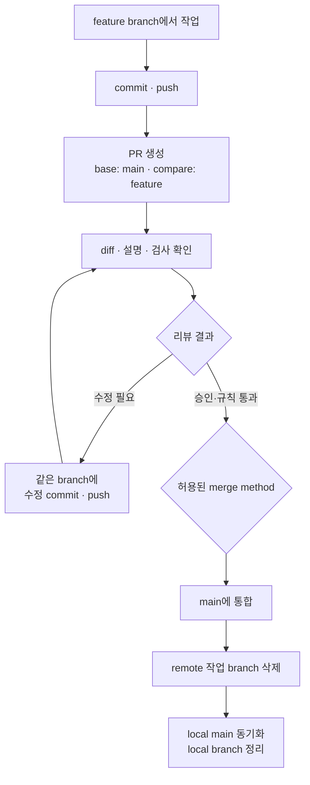

오늘은 3일동안 공부한 git을 활용해서 github의 원격저장소를 이용한 협업 미니 프로젝트를 진행했다. 팀원은 나 포함 5명. 주제는 게임을 만들어보는걸로 정했다.

강의를 들으면서 그때 그때 기록한 내용과 실습했던 스크린샷 그리고 Daily quest를 풀면서 자신이 있었는데 막상 시작이 되니까 머리가 백지가 됐다.

먼저 PM을 정해서 레포를 만들고, clone으로 가져왔다. 게임에 필요한 요소들 중 character을 맡았고 branch 생성을 PM에게 요청했다.

근데 여기서 헷갈리는 부분이 있다.
갓 생성된 repo를 clone하면 branch는 main만 있는 상태고 굳이 PM에게 요청하지 않고 내가 feature branch를 생성해도 되는거 아닌가?

결국 작업이 끝나고 레포로 push를 하게되면 main과 병합하기 위한 pr을 요청하니까

위 내용을 AI에게 물어보니 "기술적으로는 맞고 팀 컨벤션을 어떻게 하냐의 문제"라는 답을 들었다.

이후 dev/char branch에서 character 관련 코드를 작성한 후
git add . -> git commit -m "feat: 좌우 이동기능 추가" -> git push origin dev/char 로 푸쉬 후 dev/char 브랜치의 PR을 요청했다.

우리팀은 승인 리뷰가 3개이상 달려야지 PR이 main에 병합되는걸로 정했다.

곧 바로 승인 리뷰가 달렸고 병합되어서 Delete branch를 눌러 삭제했다.

### 오늘 배운 것
