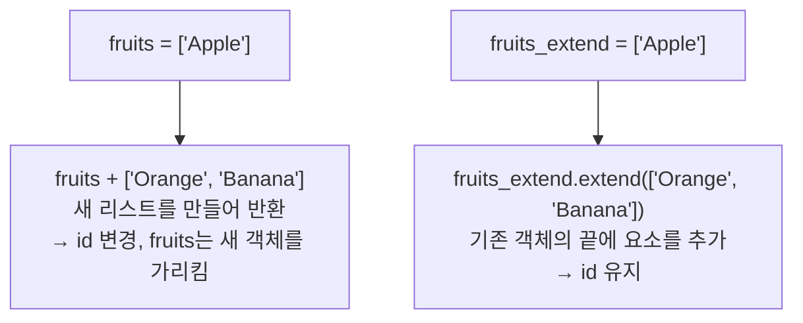

오늘은 자료구조를 배웠다.
자료구조는 시퀀스, 매핑, 집합으로 나뉜다.

시퀀스는 순서가 있고 인덱싱이 가능한 자료구조로 리스트, 튜플, 레인지가 있다.

매핑은 키를 통해 값을 저장하는 구조로 딕셔너리가 있다.

집합은 순서가 없고 중복을 허용하지 않는 자료구조이다.

CRUD는 
Create, Read, Update, Delete의 약자로 자료구조에 데이터를 추가, 조회, 수정, 삭제하는 연산이다.

List의 메서드중 extend는 + 연산과 동일한 기능을 수행하지만, extend는 리스트를 직접 수정하고 + 연산은 새로운 리스트를 반환한다.

슬라이싱은 리스트·튜플의 특정 구간을 잘라내고 새로운 리스트·튜플을 생성한다.

[시작:] - 시작 인덱스부터 끝까지

[:끝] - 처음부터 끝 인덱스 미만까지 (끝 인덱스는 포함 안 됨)

[시작:끝] - 시작 이상, 끝 미만

[시작:끝:증감] - 시작부터 끝 미만까지 증감 단위로 추출

튜플은 변경 불가 리스트다. 생성 후 요소를 추가·수정·삭제할 수 없고 읽기 전용이다.

소괄호 ( )로 정의하지만, 소괄호를 생략하고 쉼표로만 나열해도 튜플이다.
값이 하나인 경우 튜플은 반드시 (값,) 형태로 정의해야한다.

패킹은 여러 값을 쉼표로 나열해 하나의 변수에 대입 -> 자동으로 튜플 생성

언패킹은 튜플의 각 원소를 별도의 변수에 대입 -> 자동으로 튜플 해체

*rest는 변수 개수가 부족할 때 남은 요소를 리스트로 묶어서 받음

딕셔너리는 키와 값을 한 쌍으로 묶어 관리한다.
내부적으로 해시 테이블을 사용해 키를 고유 위치로 변환하므로, 값을 빠르게 찾을 수 있다.

{"키": "값"} 형태로 중괄호를 사용한다 { }

키: 값을 찾기 위한 키워드. 중복 불가, 리스트는 키로 사용 불가

값: 키로 찾는 데이터. 중복 가능

딕셔너리에 없는 키로 값을 찾을 경우 keyerror가 발생하기에 get() 메서드를 사용하면 None을 반환시켜 에러를 방지한다.

집합은 중복을 허용하지 않고 순서가 결정되지 않아 인덱싱 슬라이싱이 불가능하다.

집합 연산

a | b = 합집합 - 두  집합의 모든 원소

a & b = 교집합 - 두 집합이 공통으로 가진 원소

a - b = 차집합 - a에는 속하지만 b에는 속하지 않는 원소

a ^ b = 대칭차집합 - a 또는 b에는 속하지만 양쪽 모두에는 속하지 않는 원소

집합은 중복을 허용하지 않기에 리스트에서 중복된 값을 제거할 때 유용하다. 

명시적 형변환으로   리스트의 요소를 집합으로 바꾼 후 다시 리스트로 변환하면 중복이 제거되고 인덱싱과 슬라이싱을 사용 할 수 있게 된다.