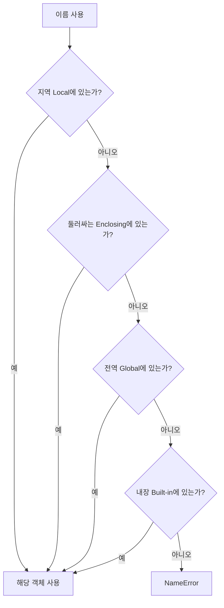
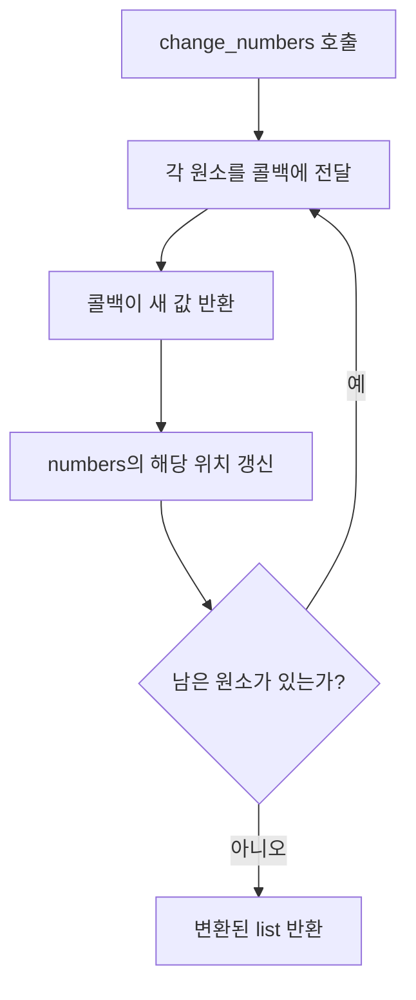
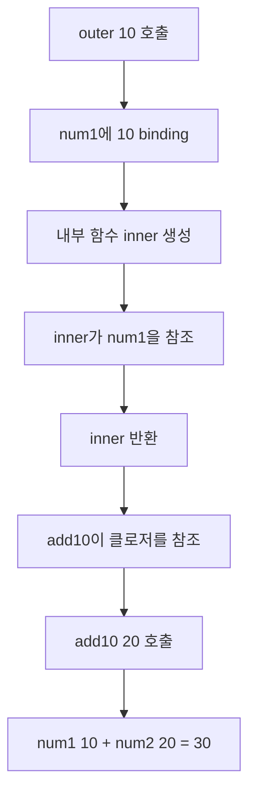
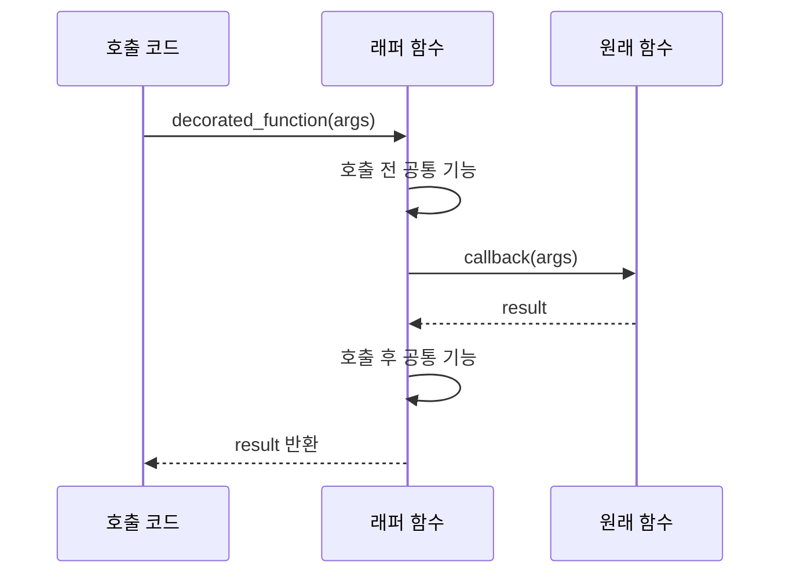
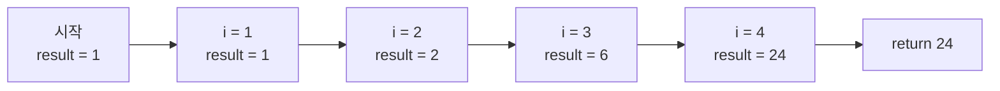
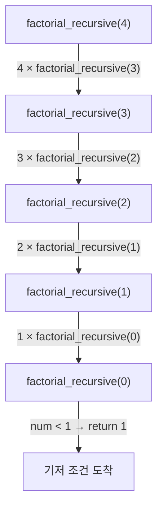
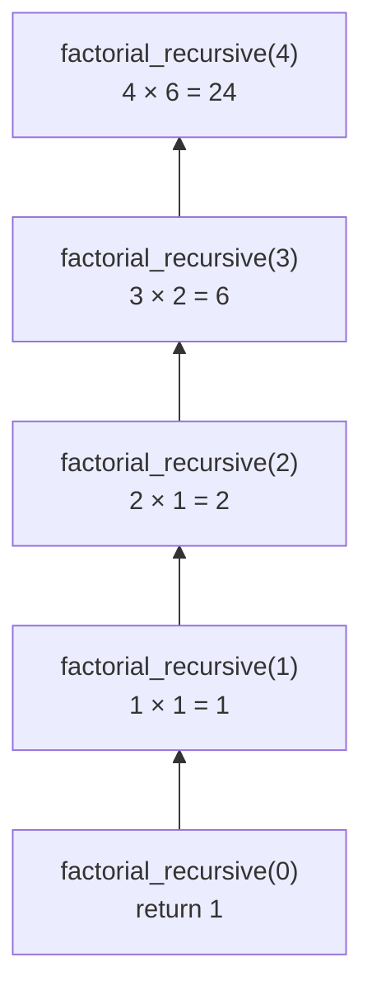
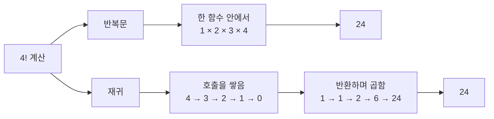

오늘은 스코프와 클로저 데코레이터를 배웠다.

Scope는 특정 이름에 접근할 수 있는 코드의 범위다.
같은 a라는 변수도 어느 범위에 생성되었는지에 따라 서로 다른 객체를 가리킬 수 있다.
```
a = 10 # global

def func():
	b = 20 # local
	print(f"{a=},{b=}")
	
	print(a) # 10
	func() # a=10 , b=20

# print(b) # NameError: b는func 밖에서 찾을 수 없다.
```

Local은 현재 함수 내부에서 생성되고 함수 종료 후 Local Frame에서 사라진다.
Enclosing은 감싸는 외부 함수 내부에 생성되고 함수 종료 후 Closure가 참조하면 유지될 수 있다.


함수 안에서 전역변수의 값을 변경하려면 global 'name' 으로 변경 할 수 있다.
가장 가까운 외부 함수의 값을 변경할 땐 nonlocal 'name' 으로 변경 할 수 있다.

일급 함수(First_class Object)
- 변수에 할당 가능
- 리스트나 딕셔너리 같은 자료구조에 담는다.
- 다른 함수의 인수(Argument)로 전달한다.
- 다른 함수의 반환값(Return Value)으로 반환한다.
```
def square(num):
	return num **2
	
operation = square
operation(10)    # 100
```

콜백 함수(Callback Function)와 고차 함수(Higher-order Function)

'콜백 함수'는 다른 함수에 전달되어 특정 시점에 호출되는 함수다.
함수를 인수로 받거나 반환값으로 반환하는 함수를 '고차 함수'라고 한다.
```
def change_numbers(callback, *args): # 가변인수
	numbers = list(args) # 리스트에는 10,20,30 담긴다.
	
	for i in range(len(numbers)): # i 는 0,1,2
		numbers[i] = callback(numbers[i])
		# numbers 인덱싱으로 값을 하나씩 꺼내서 square의 인수로 들어간다
		
	return numbers # 연산 된 값 100, 400, 900이 numbers에 반환된
	
def square(num):
	return num ** 2
	
change_numbers(square, 10,20,30)
```


람다는 짧은 함수를 한줄로 작성하는 문법이다.
일회성으로 사용되는 경우가 많아 매개변수는 간단하게 적는다.
람다도 함수 객체이므로 변수에 저장할 수 있따.
```
lambda 매개변수들: 반환할_식

square = lambda x: x **2
square(10) # 100
```

map() , filter() 은 파이썬의 내장함수이다. 각각 변환과 선별에 사용된다.
```
fruits = ['사과', '오렌지', '망고']
result = list(map(lambda x: f"**{x}**", fruits))
# list로 형변환 하지 않으면 map 객체를 반환한다.

numbers = list(range(1, 11))
odds = list(filter(lambda x: x % 2 == 1, numbers))
# filter 역시 filter 객체를 반환한다.
```

클로저는 외부 함수가 끝난 뒤에도 내부 함수가 자신이 참조하던 둘러싼 범위의 상태를 기억하는 구조다.
```
def outer(num1):
	def inner(num2):
		return num1+num2
		
	return inner

add10 = outer(10)
add10(20) # 30
add10(30) # 40
```


데코레이터는 기존 함수를 수정하지 않고, 앞 뒤로 새로운 기능을 추가해준다.
데코레이터 역시 함수를 매개변수로 받는 클로저이다.
위 내용에서는 num1을 저장했고 데코레이터는 원본함수 callback을 저장해두고 앞뒤로 부가기능을 붙인 내부함수 wrapper을 반환한다.
```
def deco_border(callback):
	def wrapper():
		print("-" * 5)
		callback()
		print("-" * 5)
	return wrapper
	
@deco_border
def show_welcome():
	print("환영합니다 스파르타님")
	
show_welcome()
```

```
@deco_border
def show_welcome():
	...
	# 위 내용을 풀어쓰면 아래와 같다
	
show_welcome = deco_border(show_welcome)
```


팩토리얼 반복문과 재귀 함수
```
# 반복문은 새로운 함수 호출을 만들지 않고 하나의 함수안에서 i가 바뀌고 result가 갱신

def factorial_loop(num):
	result = 1
	for i in range(1, num+1):
		result *= i
	return result
```


```
# 재귀 함수는 실행 중에 자기 자신을 다시 호출하는 함수

def factorial_recursive(num):
	if num < 1:
		return 1
	return num * factorial_recursive(num - 1)
```

```
# 재귀 호출을 멈추는 조건. 이것이 없으면 RecursionError가 발생

if num < 1:
	return 1
```

```
# 현재 num은 남겨두고, num - 1의 계산을 자신에게 맡김

return num * factorial_recursive(num - 1)
```


각 호출은 아래 호출의 반환값을 기다린다.
```text
4 × factorial_recursive(3)
    3 × factorial_recursive(2)
        2 × factorial_recursive(1)
            1 × factorial_recursive(0)
                return 1
```

반환되면서 계산되는 과정



재귀의 핵심은 각 호출 정보가 호출 스택에 쌓인다.

