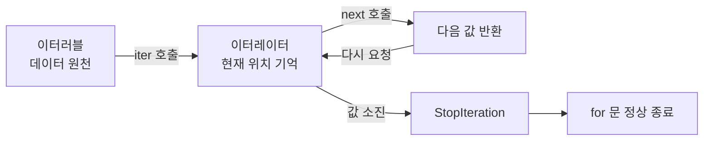
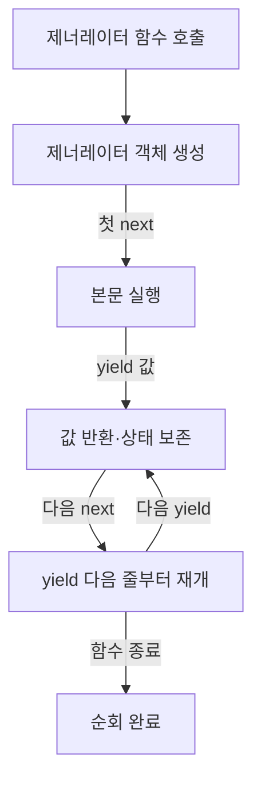

오늘은 이터레이터, 제너레이터, 모듈과 패키지를 배웠다.

이터러블(Iterable) - iter()에 넣으면 이터레이터를 뽑아낼 수 있는 객체(반복 가능한 객체)

이터레이터(Iterator) - next()로 다음 값을 꺼낼 수 있고, 자기 자신도 이터러블인 객체

비유
이터러블 = 책 : 정보 덩어리일 뿐, "다음"이라는 개념이 없다. 리스트/튜플/문자열/딕셔너리

이터레이터 = 책갈피를 끼운 상태 : "어디까지 읽었는지" 상태를 기억한다.

```
nums = [1, 2, 3] # 이터러블(책)

it = iter(nums) # 이터레이터(책갈피 끼움)

print(next(it)) # 1
print(next(it)) # 2
print(next(it)) # 3
print(next(it)) # StopIteration Error
```

핵심 포인트
1. 이터러블은 재사용 가능 - iter()를 몇 번이고 호출해서 새 책갈피를 새로 만들 수 있음
2. 이터레이터는 일회용 - 끝까지 읽으면 처음으로 못 돌아감. 다시 iter()로 새로 받아야 함
3. 이터레이터도 이터러블이다 - iter(이터레이터)를 호출하면 자기 자신을 반환함



제너레이터(Generator)는 값을 한꺼번에 만들어 반환하지 않고, 필요할 때마다 하나씩 생성한다. 

함수 본문에 'yield'가 있으면 그 함수는 제너레이터 함수가 된다.
```
def generate_nums():
	print("1번")
	yield 10
	
	print("2번")
	yield 20
	
	print("3번")
	yield 30
	
gen = generate_nums() # 객체만 생성

print(next(gen)) # 1번 출력 후 10 반환, 첫 yield에서 일시정지
print(next(gen)) # 2번 출력 후 20 반환, 두 번째 yield에서 일시정지
print(next(gen)) # 3번 출력 후 30 반환, 세 번째 yield에서 일시정지
```


일반 함수와 비교

| 구분         | 일반 함수의 `return`  | 제너레이터 함수의 `yield`        |
| ---------- | ---------------- | ------------------------ |
| 값을 내보내는 시점 | `return`에 도달했을 때 | 각 `yield`에 도달했을 때        |
| 실행 상태      | 해당 호출 종료         | 상태를 보존하고 일시 정지           |
| 다시 호출/요청   | 함수를 처음부터 새로 호출   | 같은 객체에 `next()`하여 이어서 실행 |
| 적합한 상황     | 하나의 완성된 결과       | 연속 데이터, 스트리밍, 대용량 처리     |

리스트 컴프리헨션과 제너레이터 표현식
```
a = [i**2 for i in range(50001)] # List
b = (i**2 for i in range(50001)) # Tuple이 아니다. type으로 확인해보면 class generator 이 나옴. 튜플을 결정하는건 ',' 쉼표.
```

| 비교     | 리스트 컴프리헨션(List Comprehension) | 제너레이터 표현식(Generator Expression) |
| ------ | ----------------------------- | ------------------------------- |
| 괄호     | `[...]`                       | `(...)`                         |
| 계산 시점  | 생성할 때 전체 계산                   | 값을 요청할 때 계산                     |
| 결과     | 리스트                           | 제너레이터 객체                        |
| 반복     | 여러 번 다시 순회 가능                 | 한 번 소진하면 다시 생성해야 함              |
| 인덱싱    | 가능                            | 직접 인덱싱 불가                       |
| 적합한 상황 | 결과 전체가 필요함                    | 한 번씩 처리하거나 데이터가 매우 큼            |

모듈은 Python 코드를 담은 .py 파일이다. 관련 함수, 변수, 클래스를 분리해 다른 파일에서 재사용 할 수 있다.

```
def add(num1, num2)
	return num1 + num2
	
def minus(num1, num2)
	return num1 - num2
	
	
VERSION = "1.0.0"

if __name__ == "__main__":
	print("모듈명", __name__)
	result = add(10, 20)
	print("결과:", result)
```

```
import mod1

print(mod1.add(10, 20))    # 30
print(mod1.minus(10, 3))   # 7
print(mod1.VERSION)    # 1.0.0
```

패키지는 관련 모듈을 디렉터리 단위로 묶은 구조다
```text
project/
├─ main.py
├─ mod1.py
└─ game/
   ├─ __init__.py
   ├─ lol.py
   └─ wow.py
```
- `mod1.py`: 독립 모듈
- `game/`: 패키지
- `game/lol.py`, `game/wow.py`: 패키지 안의 하위 모듈
- `game/__init__.py`: 일반 패키지를 초기화하는 파일

init.py은 이 폴더가 그냥 폴더가 아닌 '패키지'라는 걸 파이썬에게 알려주고, 패키지를 import 할 때 실행되는 초기화 코드를 담는 파일

절대 가져오기
```
from game import lol
from game.lol import LOL
```

상대 가져오기
```
# game/__init__.py
from .lol import LOL
```
- . : 현재 패키지
- .. : 상위 패키지