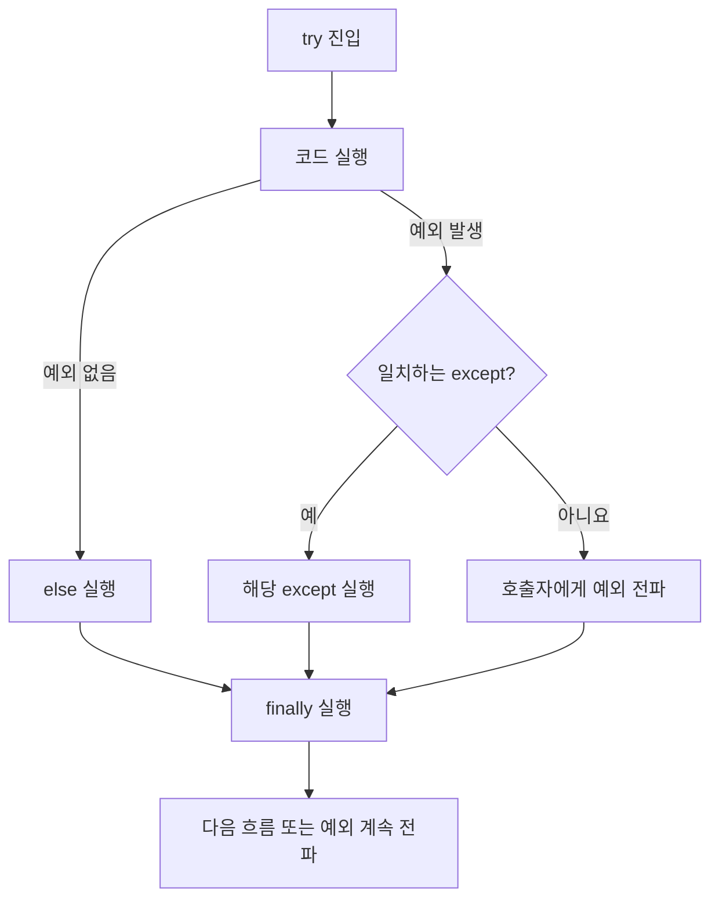

오늘은 예외처리와 디버깅을 배웠다.

구문 오류는 파이썬 문법 규칙을 지키지 않아 코드를 실행할 수 없는 상태다.
`SyntaxError`
```
if True
	print("실행되지 않음")
```

```
SyntaxError: expected ':'
```

실행 중 예외는 문법은 맞지만 실행 도중 연산을 계속할 수 없을 때 발생한다.
단순 논리 실수뿐 아니라 잘못된 입력, 없는 파일, 네트워크 실패처럼 외부 조건 때문에도 생길 수 있다.
```
number = int("둘")
```

```
ValueError: invalid literal ofr int() with base 10: '둘'
```

| 구분                   | 발견 시점           | 코드 실행 여부         | 예시                |
| -------------------- | --------------- | ---------------- | ----------------- |
| 구문 오류(Syntax Error)  | 코드를 해석·컴파일하는 단계 | 해당 코드 실행 전 중단    | 콜론 누락, 괄호 불일치     |
| 실행 중 예외(Exception)   | 프로그램 실행 중       | 예외가 발생한 지점까지는 실행 | 0으로 나누기, 잘못된 형 변환 |
| 논리 오류(Logical Error) | 실행 후 결과를 검토할 때  | 끝까지 실행될 수도 있음    | 평균 공식이 잘못되어 오답 반환 |

대표 예외

| 예외                  | 발생하는 대표 상황               |
| ------------------- | ------------------------ |
| `IndexError`        | 시퀀스의 존재하지 않는 인덱스 접근      |
| `ValueError`        | 타입은 받을 수 있지만 값의 내용이 부적절함 |
| `TypeError`         | 연산·함수가 요구하는 타입과 맞지 않음    |
| `ZeroDivisionError` | 0으로 나누거나 나머지를 구함         |
| `NameError`         | 현재 이름 공간에 없는 이름 사용       |
| `KeyError`          | 딕셔너리에 없는 키를 `[]`로 접근     |
| `AttributeError`    | 객체에 없는 속성·메서드 접근         |
| `FileNotFoundError` | 존재하지 않는 파일 열기            |

try-except-else-finally 실행 흐름



```
try:
	number = int(input("0이 아닌 정수: "))
	result = 10 / number
	
except ValueError:
	print("정수만 입력하세요.")
	
except ZeroDivisionError:
	print("0은 입력할 수 없습니다.")

else:
	print(f"계산 결과: {result}")
	
finally:
	print("계산 시도 종료")
```

| 입력  | 실행 경로                                      | 핵심 결과        |
| --- | ------------------------------------------ | ------------ |
| `2` | `try → else → finally`                     | `계산 결과: 5.0` |
| `0` | `try → ZeroDivisionError except → finally` | 0 입력 안내      |
| `둘` | `try → ValueError except → finally`        | 정수 입력 안내     |

else가 필요한 이유
성공 후 실행할 코드를 `try`안에 계속 넣으면 그 코드에서 새로 발생한 예외까지 앞의
`except`가 잘못 잡을 수 있다. **실패 가능 코드**만 `try`에 두고 성공 후 처리는 else에 두면 책임이 분명해진다.

예외를 잡는 순서와 범위
```
try:
	number = int(input())
	print(10 / number)
	
except ZeroDivisionError:
	print("0은 입력할 수 없습니다.")
	
except ValueError:
	print("정수만 입력하세요.")
	
except Exception as error:
	print(f"예상하지 못한 오류: {error}")
```

```
# 피해야 할 구조
※`Exception`은 파이썬의 거의 모든 내장 예외들의 부모 클래스 ※
try:
	...
except Exception:
	print("모든 오류")
	
except ValueError:   # 도달할 수 없음
	print("잘못된 값")
```
`Exception`이 먼저 오면 구체적인 예외를 알 수 없다.

```
try:
	...

except:
	print("문제가 생김")
```
단독 `except:`는 일반적인 프로그램 오류뿐 아니라 `KeyboardInterrupt`,`SystemExit`같은 종료·중단 신호까지 잡을 수 있어 문제 원인을 숨기기 쉽다. 보통 다음 원칙을 쓴다.

1. 예상 가능한 구체적 예외를 먼저 잡는다.
2. 정말 필요한 경계에서만 마지막에 `except Exception as error:`를 둔다.
3. 로그에는 예외 타입과 트레이스백을 남긴다.
4. 처리할 수 없는 예외는 억지로 삼키지 말고 다시 전파한다.

`raise`는 현재 함수가 처리할 수 없는 잘못된 상태를 명시적으로 호출자에게 전달하는 문법이다.

```
def withdraw(balance, amount):
	if amount <= 0:  # 15000이 들어가서 False 다음 if로 내려감
		raise ValueError("출금액은 0보다 커야 합니다.")
	
	if amount > balance:  #15000 > 10000 True로 raise를 실행
		raise ValueError("잔액이 부족합니다.")
	return balance - amount
```

```
try:
	new_balance = withdraw(10000, 15000)

except ValueError as error:
	print(error)
	
else:
	print(f"출금 후 잔액: {new_balance}")   # 잔액이 부족합니다.
```

`사용자 정의 예외`는 클래스를 만들고 `Exception`을 상속받아 사용한다.
```
class UserIdMismatchError(Exception):
	pass
	
class UserPassMismatchError(Exception):
	pass
	
def login(user_id, user_pass):
	if user_id != "user01":
		raise UserIdMismatchError("아이디가 일치하지 않습니다.")
	
	if user_pass != "1234":
		raise UserPassMismatchError("비밀번호가 일치하지 않습니다.")
	
	return "로그인 성공"
```

호출 위치마다 같은 login()을 재사용하면서 후속 행동만 다르게 만들 수 있다.

```
# 회원 페이지
try:
	message = login("user02", "1234")
	
except UserIdMismatchError as error:
	print(error)
	print("아이디 찾기 링크 표시")
	
except UserPassMismatchError as error:
	print(error)
	print("비밀번호 재설정 링크 표시")
	
else:
	print(message)
```

```
# 관리자 페이지
try:
	login("user02", "1234")

except (UserIdMismatchError, UserPassMismatchError) as error:
	print(f"로그인 거부: {error}")
	print("보안 감사 로그 기록")
```

`as`는 `except`절에만 쓸 수 있는 문법.
`raise` 시점에서 하는 일은 예외 객체를 새로 만들어서 던지는게 전부
함수를 호출한 쪽에 `try-except`가 있으면 예외를 잡고 `as`를 사용할 수 있음

왜 `ValueError` 하나보다 사용자 정의 예외가 유용한가?
```
try:
	login("user02", "1234")

except ValueError:
	# 아이디 문제인지 비밀번호 문제인지 타입만으로 알 수 없음
	...
```

예외 전파는 함수 안에서 예외를 처리할 `except`가 없으면, 예외를 처리할 수 있는 `except`를 만날 때까지(또는 전역까지) 반복된다.

```
def parse_number(text):
	return int(text)      # 1. ValueError 발생 예외 처리되지 않고 POP
	
def calculate(text):
	number = parse_number(text)  # 2. parse에서 발생한 에러 처리 못하고 POP
	return 10/ number

try:
	print(calculate("둘"))         # 3. 여기서 예외처리
except ValueError as error:
	print(f"입력 오류: {error}")
```

트레이스백은 예외가 발생하기까지 거친 함수 호출 경로(Call Stack)를 기록한다.
```
def calculate_average(scores):
	total = sum(scores)
	count = len(scores)
	return total / count
	
def process_report():
	student_scores = []
	result = calculate_average(student_scores)
	print(f"평균 점수: {result}")
	
process_report()
```

```
ZeroDivisionError Traceback (most recent call last)

Cell In[50], [line 13]
9 result = calculate_average(student_scores) 
10 print(f"평균 점수: {result}") 
11 
12 
---> [13] process_report() 

Cell In[50], [line 9]
7 def process_report(): 
8 student_scores = [] 
----> [9]result = calculate_average(student_scores) 
10 print(f"평균 점수: {result}") 

Cell In[50], [line 4](vscode-notebook-cell:?execution_count=50&line=4) 
1 def calculate_average(scores):
2 total = sum(scores) 
3 count = len(scores) 
----> [4]return total / count ZeroDivisionError: division by zero

ZeroDivisionError: division by zero
```

1. 마지막 줄: 예외 타입과 메시지 확인 -> `ZeroDivisonError: divison by zero`
2. 바로 위 프레임: 실제 예외가 발생한 코드 확인 -> total / count
3. 그 위 프레임: 누가 그 함수를 호출했는지 역추적 -> 빈 `student_scores`가 전달