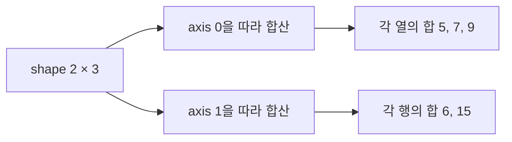

### 오늘의 핵심
1. NumPy 배열은 같은 자료형의 값을 다차원 구조로 저장하고, 반복문을 직접 작성하지 않아도 벡터화 연산을 수행한다.
2. `axis`는 막연히 "행 기준/열 기준"이라 외우기보다 어느축을 따라 값을 모아 그 축을 없애는가로 이해해야 한다.
3. 브로드캐스팅은 작은 배열을 실제로 여러 번 복사하는 문법이 아니라, 호환되는 형상끼리 원소별 연산을 가능하게 하는 규칙이다.
4. Pandas는 Numpy의 배열 연산 위에 행·열 레이블, 서로 다른 열 자료형, 결측치 처리와 분석기능을 더한다.
5. 머신러닝 전에 `info()`로 자료형·결측 여부를 확인하고 `describe()`로 분포·극단값을 점검해야 한다. 입력 데이터가 잘못되면 모델도 잘못 학습한다.
---
NumPy의 핵심 객체는 다차원 배열이다. 일반적으로 한 배열의 원소는 같은 `dtype`을 사용하므로, 숫자 데이터를 일정한 크기로 저장하고 C로 구현된 벡터화 연산을 효율적으로 적용할 수 있다.
```
import numpy as np

nums = np.array([10,20,30], dtype=np.float64)
print(nums)       # [10. 20. 30.]
print(nums.dtype) # float64
print(nums.shape) # (3,)
print(nums.ndim)  # 1
```

| 속성      | 의미            | 위 예제의 값   |
| ------- | ------------- | --------- |
| `dtype` | 원소의 자료형       | `float64` |
| `shape` | 각 축의 길이       | `(3,)`    |
| `ndim`  | 축의 개수, 즉 차원 수 | `1`       |
| `size`  | 전체 원소 수       | `3`       |

벡터(Vector), 행렬(Matrix), 텐서(Tensor)
```
vector = np.array([10,20,30])

matrix = np.array([
	[10,20,30],
	[40,50,60],
	[70,80,90]
])
```

| 차원     | 흔히 사용하는 이름  | `shape` 예시  |
| ------ | ----------- | ----------- |
| 0차원    | 스칼라(Scalar) | `()`        |
| 1차원    | 벡터(Vector)  | `(3,)`      |
| 2차원    | 행렬(Matrix)  | `(3, 3)`    |
| 3차원 이상 | 텐서(Tensor)  | `(2, 3, 4)` |
머신러닝에서는 샘플과 특성을 보통 2차원 배열로 표현한다.
```text
shape = (샘플 수, 특성 수)
```

예를 들어 학생 100명의 키, 몸무게, 나이를 저장하면 `(100,3)`형태가 된다.

인덱싱과 슬라이싱

2차원 배열은 `array[행, 열]` 순서로 접근한다.

```
matrix[0,2]      # 30
matrix[0:2, 1:3] # 0~1행, 1~2열
matrix[:, 0]     # 모든 행의 0번째 열
matrix[1:, :2]   # 1번 행부터 끝까지, 0~1열
```

`arange()`, `reshape()`, `flatten()`

```python
arr = np.arange(1, 13)
mat_3x4 = arr.reshape(-1, 4)
flat_arr = mat_3x4.flatten()
```

```
arr.shape -> (12,)
mat_3x4.shape -> (3, 4)
flat_arr.shape -> (12,)
```

- `np.arange(1,13)`은 1 이상 13미만의 정수를 만든다.
- `reshape(-1,4)`에서 `-1`은 다른 축과 전체 원소 수를 보고 Numpy가 길이를 계산하라는 뜻이다.
- `reshape()`는 원소 수를 바꾸지 않고 배열의 해석 구조만 바꾼다.
- `flatten()`은 다차원 배열을 1차원 복사본으로 만든다.

축(Axis)을 정확하게 읽는 법

다음 배열의 형상은 `(2,3)`이다.
```
mat = np.array([
	[1,2,3],
	[4,5,6],
])
```


- `mat.sum(axis=0)`은 0번 축, 즉 행 방향으로 내려가며 값을 모은다. 행 축이 사라지고 각 열의 합 `[5, 7, 9]`가 남는다.
- `mat.sum(axis=1)`은 1번 축, 즉 열 방향으로 가로지르며 값을 모은다. 열 축이 사라지고 행의 합 `[6, 15]`가 남는다.

브로드캐스팅
스칼라와 배열을 연산하면 스칼라가 모든 원소에 적용된다.
```
mat = np.array([
	[10,20,30],
	[40,50,60],
])

mat * 5
mat + 5
```

1차원 벡터 `(3,)`도 행렬`(2,3)`의 마지막 축과 맞기 때문에 각 행에 적용할 수 있다.
```
vec = np.array([1,2,3])
mat + vec
```

```
[[11,22,33],
 [41,52,63]]
```

형상 호환 규칙

두 배열의 형상을 오른쪽 끝 축부터 비교한다. 각 축이 다음 중 하나면 호환된다.
1. 두 축의 길이가 같다.
2. 둘 중 하나의 길이가 `1`이다.
3. 한 배열에 그 축이 없다.

```
(2, 3)
   (3,) -> 가능
   
(2, 3)
   (2,) -> 불가능 : 마지막 축 3과 2가 다름
```

전치

전치는 행과 열의 축을 맞바꾼다.
```
mat = np.array([
	[1,2,3],
	[4,5,6],
])

mat.transpose()
mat.T
```

두 표현의 결과는 모두 `(3,2)`형상이다.

```
[[1,4],
 [2,5],
 [3,6]]
```

원소별 곱과 행렬곱
```
mat1 = np.array([[10,20],
				 [30,40]])

mat2 = np.array([1,2],
				[3,4]])

mat1 * mat2 # 같은 위치 원소끼리 곱셈
mat1 @ mat2 # 행렬곱
```

행렬곱에서 `(m, n) @ (n, p)`의 안쪽 차원 `n`이 같아야 하며 결과 형상은 `(m, p)다.`

```
mat1 @ mat2
-> [[70, 100],
    [150, 200]]
```

첫 번째 원소 `70`은 다음과 같이 계산된다.

$$
10 \times 1 + 20 \times 3 = 70
$$

Pandas는 데이터 분석을 위해 레이블이 있는 자료구조를 제공한다.

| 구조          |  차원 | 핵심 구성                 |
| ----------- | --: | --------------------- |
| `Series`    | 1차원 | 값 + 인덱스               |
| `DataFrame` | 2차원 | 행 인덱스 + 열 이름 + 열별 데이터 |

```
import pandas as pd

scores = pd.Series([90,85,88])
```

```
0    90
1    85
2    88
dtype: int64
```

```
data = {
	"이름": ["김철수", "이영희", "박민수"],
	"부서": ["개발", "기획", "개발"]
	"급여": [4500, 5200, 48000]
}

df = pd.DataFrame(data)
```

DataFrame은 열마다 서로 다른 자료형을 가질 수 있다. 위 예시에서는 문자열 열과 정수형 열이 함께 존재한다.

탐색적 데이터 분석(Exploratory Data Analysis, EDA)
EDA는 모델을 만들기 전에 데이터의 구조, 분포, 결측치, 이상치를 먼저 살펴보는 과정이다.


`info()`

```
df.info()
```
주로 다음을 확인한다.
- 전체 행 수와 인덱스 범위
- 열 이름
- 각 열의 Non-Null 개수
- 각 열의 `dtype`
- 대략적인 메모리 사용량

`describe()`

`df.describe()`

기본적으로 숫자형 열의 다음 통계를 요약한다.

| 통계                  | 의미           |
| ------------------- | ------------ |
| `count`             | 결측치가 아닌 값의 수 |
| `mean`              | 평균           |
| `std`               | 표준편차         |
| `min`, `max`        | 최솟값, 최댓값     |
| `25%`, `50%`, `75%` | 사분위수         |

열 추가와 인덱스 변경

계산한 열 추가
```text
df["보너스"] = df["급여"] * 0.1
```

Pandas는 `Series` 단위의 백터화 연산을 수행하여 각 행의 급여에 `0.1`을 곱한 결과를 새 열에 저장한다.

`set_index()`와 `reset_index()`

```
df_indexed = df.set_index("이름")
df_restored = df_indexed.reset_index()
```

- `set_index("이름")`: 기존 `이름`열을 행 레이블로 이동한다.
- `reset_index()`: 행 인덱스를 다시 기본 정수 인덱스로 만들고 기존 인덱스를 열로 되돌린다.
- 두 메서드는 기본적으로 원본을 즉시 바꾸지 않고 새 DataFrame을 반환하므로 반환값을 변수에 저장해야 한다.

Pandas의 축과 레이블 정렬

열별 평균
```
df = pd.DataFrame(
	{
		"중간고사": [80,95,70],
		"기말고사": [85,90,75]
	},
	index=["김철수", "이영희", "박민수"],
)

score_means = df.mean(axis=0)
```

`axis=0`은 행 축을 따라 내려가며 계산하므로 열마다 평균 하나가 남는다.

```
중간고사  81.666667
기말고사  83.333333
```

열 평균을 각 값에서 빼기

```
score_gap = df.sub(score_means, axis=1)
```

여기서 중요한 것은 위치뿐 아니라 레이블 정렬이다.
- `score_means`의 인덱스: `중간고사`, `기말고사`
- `axis=1`: 이 인덱스를 DataFrame의 열 이름과 맞춘다.
- 각 점수에서 같은 과목의 평균을 뺀다.

```
		    중간고사    기말고사
김철수     -1.666667   1.666667
이영희     13.333333   6.666667
박민수    -11.666667  -8.333333
```

양수는 과목 평균보다 높고, 음수는 과목 평균보다 낮다는 뜻이다.